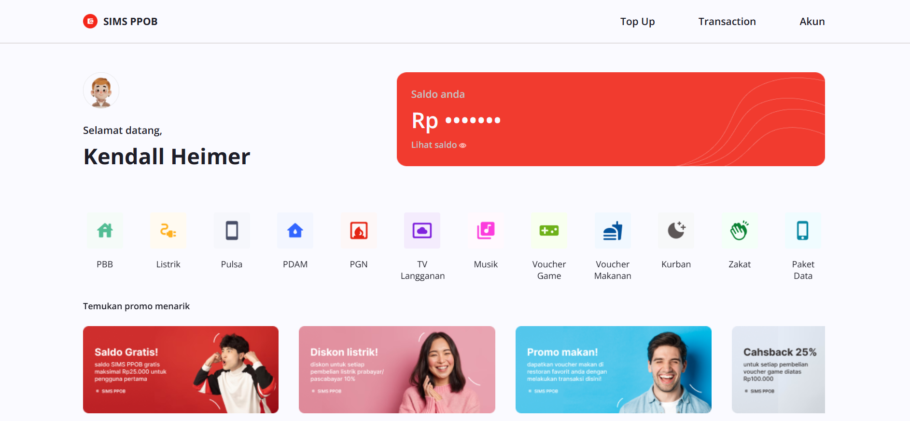
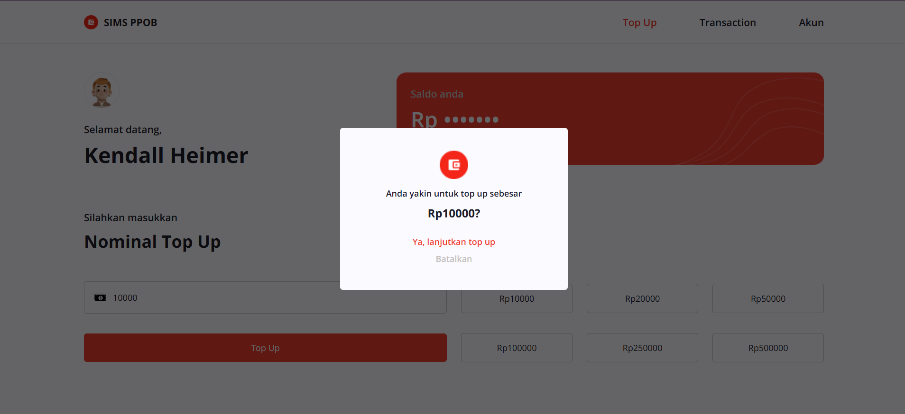
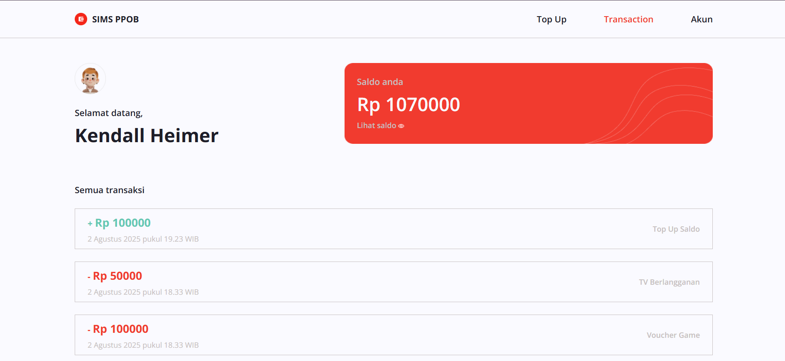

# 💳 SIMS PPOB Web App

A simple and intuitive e-wallet payment web application built with **React**, featuring top-up functionality, service transactions, promo displays, user profile management, and transaction history.

---

## 🚀 Features

- 🔐 **Authentication**
  - Login and registration flow
  - Token-based authorization

- 💰 **Balance Management**
  - Top up your balance
  - Real-time balance updates after transactions

- 🧾 **Transaction System**
  - Pay for various services
  - View transaction history

- 🧍 **User Profile**
  - View and update profile details
  - Change profile picture

- 🏷️ **Promotions**
  - Scrollable banner section for available promos

---

## 🛠️ Tech Stack

- **React** (UI library)
- **Redux Toolkit** (State management)
- **React Router** (Routing and navigation)
- **Tailwind CSS** (utility-first styling)
- **Vite** (Lightning-fast development server)
- Integration with REST API
- JWT Token for secure authentication

---

## 📁 Folder Structure
src/  
├── assets/  (Static images/icons)  
├── components/  (Shared UI components)  
├── pages/  (Route-level pages)  
├── redux/  
│ └── slices/  (Redux slices)  
├── data/  (Local mock JSONs)  
├── Router.jsx  
└── main.jsx  

## 📸 Preview
### Home
  
### Login Page
  
### Top Up Page
  
### Transaction History

